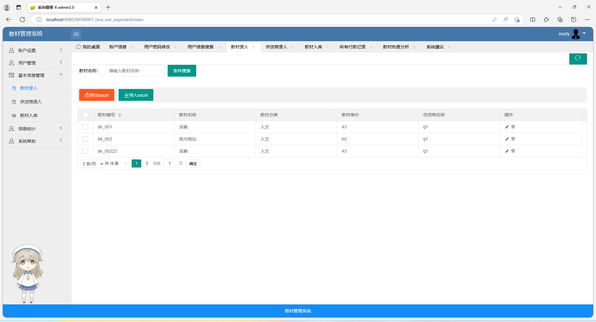
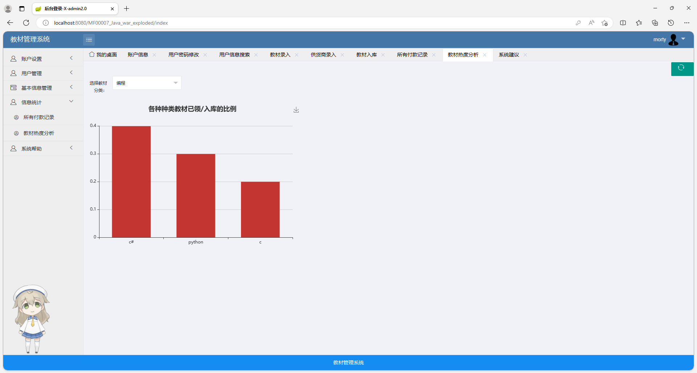
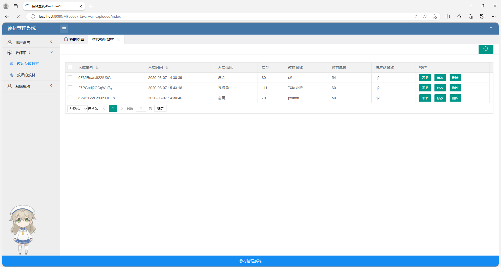
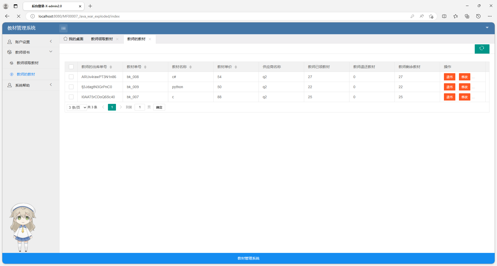
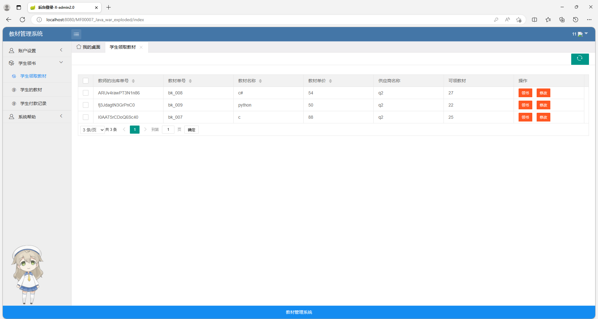
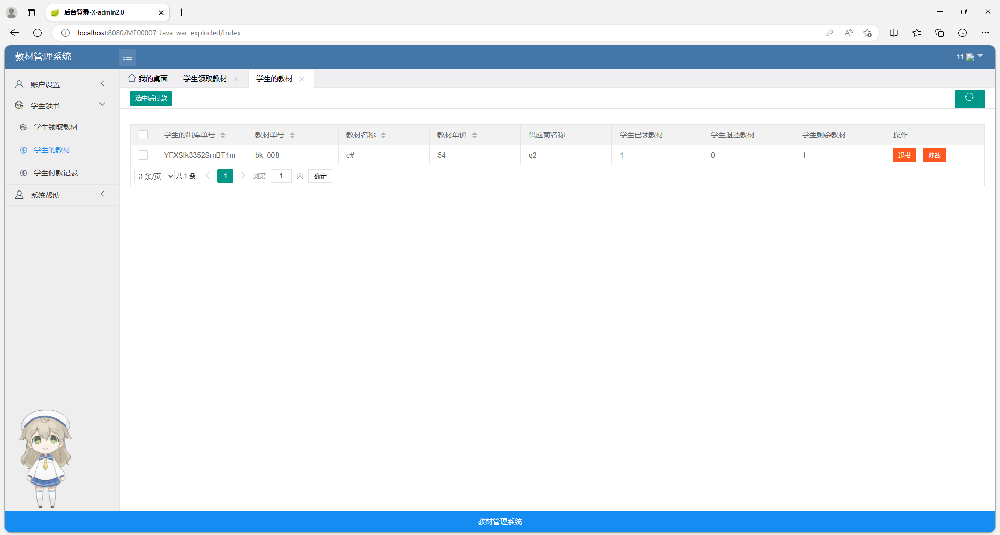

# 教材管理系统

## 一、介绍

基于spring+spring mvc+mybatis+layui+jquery+bootstrap的教材管理系统

运行环境:idea或eclipse 数据库:mysql

开发语言：java
    
## 三、系统功能截图

### 1、管理员模块部分功能页面展示

### 2、教师模块部分功能页面展示

### 3、学生模块部分功能页面展示

### 9.9￥ 获取完整源码+sql，需要加Q：3808981644 备用Q：3577148218 
### 有问题，或者需要协助调试运行项目的也可联系

